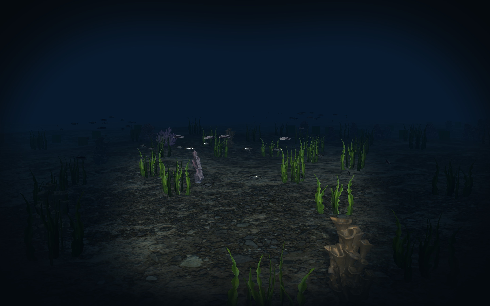
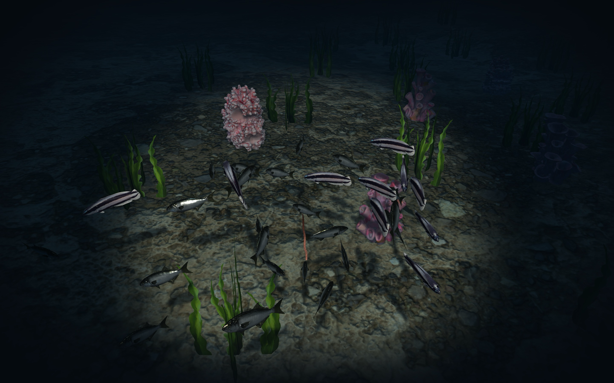
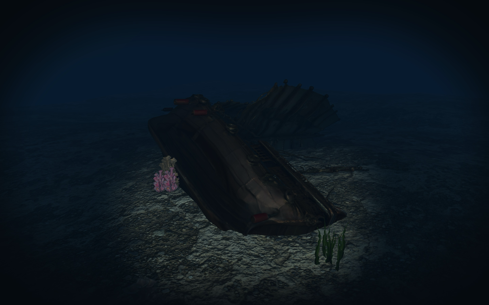

# Underwater world interactive scene

**Authors:** Oleksandr Prybylov, Anna Vasylchenko (group 12)

A first-person diver scene set on a procedurally generated sandy seabed populated with coral reefs, seaweed, rocks, a sunken ship, and schools of fish that react to the player. The world is bounded by exponential depth fog and lit by a helmet-mounted flashlight with real-time shadows.



## Chosen methods

- [x] **A07 — Instanced rendering with LOD:** corals, rocks, seaweed, and fish are drawn with instancing. Each instance picks one of three LOD tiers based on camera distance — HIGH uses the full-detail mesh, MED a reduced-poly variant, and LOW a camera-facing billboard.
- [x] **B14 — Simple creature animation state machine:** each fish has `SWIM` / `FLEE` / `CHASE` states with transitions driven by flashlight ray hits and bait proximity.

## Mandatory methods

- [x] **Normal mapping** — sand seabed and coral surfaces, tangent-space TBN.
- [x] **PBR lighting** — metallic/roughness materials for sand, coral, rock, fish.
- [x] **Quaternion camera control** — first-person diver camera with quaternion mouse look, pitch clamp, WASD/vertical movement, and smoothed velocity.
- [x] **Shadow mapping** — flashlight spotlight depth map with PCF and slope-scaled bias. Fish and corals cast shadows on the seabed.
- [x] **Parallel Transport Frames** — stable fish orientation along closed Catmull-Rom patrol loops around coral clusters.
- [x] **Underwater skybox/cubemap** — procedural blue-green gradient cubemap, bright above (with a visible sun glow) and dark abyss below.

## Controls

| Input | Action |
| --- | --- |
| `W` `A` `S` `D` | move (forward / left / back / right) |
| Mouse | look around |
| `Space` / `Left Shift` | ascend / descend |
| `F` | toggle the diver flashlight (spotlight + shadows) |
| `E` | scare fish within 30 m of the camera into FLEE with jittered timers |
| Left mouse button | throw bait in the aim direction; landed bait attracts nearby fish (CHASE state) |
| `L` | (debug) raise ambient so the scene is inspectable without the spotlight |
| `P` | (debug) draw Catmull-Rom patrol loops as coloured line strips |
| `Esc` | quit |

## Interactions (B14 state machine)

At least three runtime interactions independent of camera control, all affecting the scene:

| # | Interaction | Effect |
| --- | --- | --- |
| 1 | `F` toggle flashlight | spotlight + shadow map on/off |
| 2 | flashlight cone hits a fish | ray-sphere test within 18 m → fish enters FLEE |
| 3 | Left mouse throws bait | projectile arc; once landed, nearby fish enter CHASE and seek the bait; consumed on contact |
| 4 | `E` scare-all | every fish within 30 m of the camera enters FLEE with jittered timers |

### Fish state machine

Each fish owns one of three states plus a per-state timer and a global cooldown.

```
                       flashlight cone hits fish (18 m, ray-sphere)
                ┌─────────────────────────────────────────────────────┐
                ▼                                                     │
            ┌────────┐   bait within 20 m    ┌────────┐               │
   ────────►│ SWIM   │──────────────────────►│ CHASE  │               │
            │ patrol │◄──────────────────────│ seek   │               │
            │ +boids │  bait eaten / timeout │ bait   │               │
            └────┬───┘                       └────────┘               │
                 │                                                    │
                 │  E key scare (30 m radius, jittered timers)        │
                 │  flashlight cone hit                               │
                 ▼                                                    │
            ┌────────┐   timer expires (~5 s, jittered)               │
            │ FLEE   │────────────────────────────────────────────────┘
            │ accel. │
            │ away   │
            └────────┘
```

States:

- **SWIM** — default. Each fish follows a closed Catmull-Rom patrol loop around its nearest coral cluster (PTF orientation along the spline) with boids separation/alignment/cohesion on top via a spatial grid.
- **FLEE** — triggered by a flashlight cone hit or the `E` scare-all. Fish accelerates away from the light source with a per-fish angular bias and slow wander so the school scatters rather than bolting in lockstep. Returns to SWIM after a jittered timer (~5 s) plus a short cooldown so it doesn't immediately re-trigger.
- **CHASE** — triggered when bait lands within 20 m. Overrides the flashlight response, so fish will swim through the cone to reach a worm. Fish dive in 3D toward the bait, park at nibble range with hysteresis (so they don't flicker on the boundary), and multiple feeders share the worm — it shrinks and vanishes when fully eaten.

Transition timing uses per-fish jittered delays and reaction windows so a school reacts as a wave, not a single frame.

## Screenshots





## Build and run instructions

1. Clone the repository and enter the project root:
```bash
git clone https://github.com/7splay/underwater-computer-graphics.git
cd underwater-computer-graphics
```

### macOS

2. Install Xcode Command Line Tools if they are not installed already:
```bash
xcode-select --install
```
3. Install [Homebrew](https://brew.sh/) if needed, then install the required libraries:
```bash
brew install cmake glfw glew assimp glm
```
4. Build the project:
```bash
mkdir -p build
cmake -S . -B build
cmake --build build
```
5. Run the compiled executable:
```bash
./build/underwater-computer-graphics
```

### Windows

You need a C++ compiler, CMake, and the same third-party libraries as on macOS. The easiest setup is **Visual Studio 2022** (with the **Desktop development with C++** workload) plus **vcpkg**.

1. Install [Visual Studio 2022](https://visualstudio.microsoft.com/downloads/) with **Desktop development with C++**.
2. Install [CMake](https://cmake.org/download/) and make sure `cmake` is on your `PATH`.
3. Install and bootstrap [vcpkg](https://vcpkg.io/en/getting-started.html), for example:
```powershell
git clone https://github.com/microsoft/vcpkg.git C:\vcpkg
C:\vcpkg\bootstrap-vcpkg.bat
```
4. Install the required libraries with vcpkg:
```powershell
C:\vcpkg\vcpkg install glfw3:x64-windows glew:x64-windows assimp:x64-windows glm:x64-windows
```
5. Configure and build from the project root in **x64 Native Tools Command Prompt for VS 2022** or PowerShell:
```powershell
cmake -S . -B build -DCMAKE_TOOLCHAIN_FILE=C:/vcpkg/scripts/buildsystems/vcpkg.cmake -A x64
cmake --build build --config Release
```
6. Run the compiled executable:
```powershell
.\build\Release\underwater-computer-graphics.exe
```

The build copies `shaders/`, `img/`, and `models*` next to the executable automatically, so run the `.exe` from that output folder or pass its full path as shown above.

If CMake cannot find OpenGL, install a recent GPU driver. If DLLs are missing at runtime, copy the `glew32.dll` and `assimp-vc*-mt.dll` files from your vcpkg `installed\x64-windows\bin` folder into the same directory as the executable.

### Object density (optional)

The executable takes an optional density multiplier that scales how many corals, seaweed and fish are generated. `1.0` is the default scene; higher packs in more, lower thins it out (useful on slower machines):
```bash
./build/underwater-computer-graphics 0.5   # sparser, faster
./build/underwater-computer-graphics 2.0   # denser
```

The window title shows the current FPS. VSync is enabled, so on a 60 Hz display the app caps at a stable 60 FPS with no tearing.

## Asset layout

- `models/` — HIGH-tier meshes (full-detail): corals, fish, shark, worm, ship.
- `models_med/` — MED-tier coral variants (reduced poly count).
- `models_low/` — LOW-tier coral variants (lowest poly count); distant corals and seaweed also fall back to camera-facing billboards.
- `img/` — textures and normal maps, resolved by path convention (e.g. `coral2.obj` → `coral2.png`).
- `shaders/` — GLSL vertex and fragment programs.
